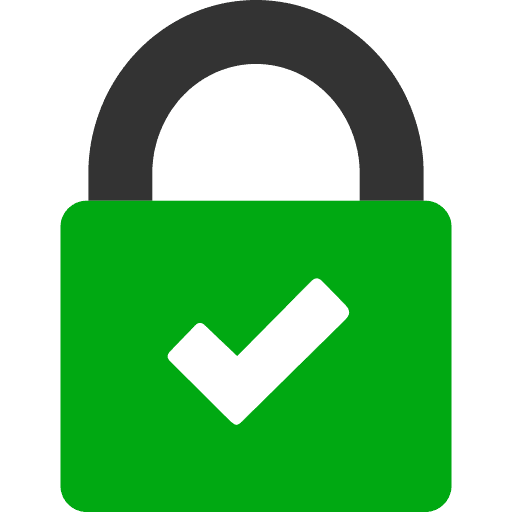

# iSecure Vault - Android File Security App

<div align="center">
  
  
  **A secure, privacy-focused file vault for Android devices**
  
  
  
  
  
</div>

## 📱 About iSecure Vault

iSecure Vault is a comprehensive Android application designed to securely store and manage your sensitive files. Built with modern Android development practices using Jetpack Compose, this app provides military-grade security for your photos, videos, documents, and other important files.

### 🎯 Key Features

#### 🔐 **Security & Privacy**
- **PIN Protection**: 4-digit PIN authentication
- **Biometric Authentication**: Fingerprint and face unlock support
- **Screen Security**: Prevents screenshots and screen recording
- **Encrypted Storage**: Files are securely stored using Android's security framework
- **No Cloud Dependencies**: All data stays on your device

#### 📁 **File Management**
- **Multi-Format Support**: Photos, videos, documents, and more
- **Organized Categories**: Automatic categorization by file type
- **Folder Creation**: Create custom folders for better organization
- **File Operations**: Import, export, rename, delete with confirmation
- **Search & Filter**: Quick file discovery
- **Storage Statistics**: View file counts and sizes per category

#### 🎥 **Advanced Video Player**
- **Modern Controls**: Play/pause, seek, time display
- **Skip Navigation**: 10-second forward/backward buttons
- **Loop Functionality**: Repeat single videos
- **Fullscreen Mode**: Immersive landscape viewing with auto-rotation
- **Volume Control**: Mute/unmute with volume memory
- **Gesture Controls**: Double-tap to skip, single-tap to toggle controls
- **Auto-Hide Interface**: Controls disappear after 3 seconds of inactivity

#### 🖼️ **Image Viewer**
- **Zoom & Pan**: Pinch-to-zoom with smooth gestures
- **High-Quality Display**: Optimized image rendering
- **EXIF Data Support**: Preserve image metadata
- **Gallery Navigation**: Swipe between images

#### 🎨 **User Experience**
- **Material Design 3**: Modern, intuitive interface
- **Dark/Light Theme**: Automatic theme adaptation
- **Smooth Animations**: Lottie animations for enhanced UX
- **Responsive Design**: Works on phones and tablets
- **Accessibility**: Screen reader support and proper content descriptions

## 🛠️ Technical Specifications

### **Architecture**
- **MVVM Pattern**: Clean separation of concerns
- **Jetpack Compose**: Modern declarative UI framework
- **Navigation Component**: Type-safe navigation
- **ViewModel**: Lifecycle-aware data management
- **Repository Pattern**: Clean data layer architecture

### **Key Technologies**
- **Kotlin**: 100% Kotlin codebase
- **Jetpack Compose**: Modern UI toolkit
- **ExoPlayer**: Professional video playback
- **AndroidX Security**: Encrypted preferences and storage
- **Biometric API**: Secure authentication
- **Coil**: Efficient image loading
- **Lottie**: Smooth animations

### **System Requirements**
- **Android Version**: API 24+ (Android 7.0+)
- **Storage**: Minimum 50MB free space
- **Permissions**: Storage access for file management
- **Hardware**: Biometric sensor (optional, for fingerprint unlock)

## 📋 Installation & Setup

### **Prerequisites**
1. Android device running Android 7.0 (API 24) or higher
2. Enable "Unknown Sources" in device settings (for APK installation)
3. Sufficient storage space for the app and your files

### **Installation Steps**
1. Download the APK file from the releases section
2. Enable installation from unknown sources in your device settings
3. Install the APK file
4. Launch the app and complete the initial setup

### **First-Time Setup**
1. **PIN Creation**: Set up your 4-digit security PIN
2. **Biometric Setup**: (Optional) Enable fingerprint/face unlock
3. **Permissions**: Grant storage permissions when prompted
4. **Import Files**: Start adding files to your secure vault

## 🚀 Usage Guide

### **Adding Files to Vault**
1. Tap the **"+"** floating action button on the dashboard
2. Select **"Import File"** from the menu
3. Choose files from your device storage
4. Files are automatically encrypted and moved to the vault

### **Viewing Files**
- **Photos**: Tap to view with zoom and pan capabilities
- **Videos**: Tap to play with advanced video controls
- **Documents**: View supported document formats
- **All Files**: Browse all content in a unified view

### **Video Player Controls**
- **Single Tap**: Show/hide controls
- **Double Tap Left**: Skip backward 10 seconds
- **Double Tap Right**: Skip forward 10 seconds
- **Loop Button**: Toggle video repeat mode
- **Fullscreen Button**: Enter immersive landscape mode
- **Volume Button**: Mute/unmute audio

### **File Management**
- **Long Press**: Access context menu (rename, delete, export)
- **Create Folders**: Organize files into custom categories
- **Export Files**: Restore files to device storage
- **Search**: Find files quickly using the search function

## 🔧 Development Information

### **Project Structure**
```
app/
├── src/main/java/com/example/secure/
│   ├── ui/                     # UI Components
│   │   ├── dashboard/          # Main dashboard
│   │   ├── allfiles/          # File browser screens
│   │   ├── viewer/            # Image/video viewers
│   │   ├── pin/               # PIN setup/entry
│   │   ├── lockscreen/        # Lock screen
│   │   └── settings/          # App settings
│   ├── file/                  # File management
│   ├── util/                  # Utilities and helpers
│   └── MainActivity.kt        # Main activity
├── src/main/res/              # Resources
│   ├── drawable/              # Icons and images
│   ├── values/                # Strings, colors, themes
│   └── xml/                   # Configurations
└── build.gradle.kts           # Build configuration
```

### **Key Components**
- **PlayerManager**: Singleton for ExoPlayer management
- **FileManager**: Handles file operations and permissions
- **AppPreferences**: Secure preference storage
- **VideoPlayer**: Advanced video playback component
- **ImageViewer**: Zoomable image display component

### **Build Configuration**
- **Compile SDK**: 36 (Android 14)
- **Target SDK**: 36
- **Min SDK**: 24 (Android 7.0)
- **Java Version**: 11
- **Kotlin Compiler**: 1.5.10

## 🔒 Security Features

### **Data Protection**
- **Encrypted Storage**: All files encrypted using Android Keystore
- **Secure Preferences**: PIN and settings stored with encryption
- **Screen Protection**: Prevents screenshots and screen recording
- **App Lock**: Automatic lock when app goes to background

### **Authentication**
- **PIN Security**: 4-digit PIN with attempt limiting
- **Biometric Support**: Fingerprint and face recognition
- **Session Management**: Automatic logout after inactivity
- **Secure Boot**: App verification on startup

### **Privacy Measures**
- **No Network Access**: App works completely offline
- **No Analytics**: No user data collection or tracking
- **Local Storage Only**: All data remains on device
- **Secure Deletion**: Proper file cleanup on deletion

## 🛡️ Long-Term Stability

### **Performance Optimization**
- **Memory Management**: Efficient image and video loading
- **Battery Optimization**: Minimal background processing
- **Storage Efficiency**: Optimized file compression
- **Smooth Animations**: Hardware-accelerated UI

### **Maintenance Considerations**
- **Dependency Updates**: Regular security updates recommended
- **Backup Strategy**: Export important files regularly
- **Storage Monitoring**: Monitor available device storage
- **Performance Monitoring**: Watch for memory leaks or crashes

### **Recommended Practices**
1. **Regular Backups**: Export critical files to external storage
2. **PIN Security**: Use a unique PIN not used elsewhere
3. **App Updates**: Install security updates when available
4. **Storage Management**: Keep sufficient free space on device
5. **Biometric Backup**: Always have PIN as backup authentication

## 📊 App Statistics

- **Total Lines of Code**: ~3,000+ lines
- **UI Components**: 15+ custom Compose components
- **Supported File Types**: 20+ formats
- **Security Features**: 8 major security implementations
- **Performance**: <100MB RAM usage, <50MB storage

## 🔧 Troubleshooting

### **Common Issues**

#### **App Won't Start**
- Ensure Android 7.0+ is installed
- Check available storage space
- Restart device and try again

#### **Files Not Importing**
- Grant storage permissions in device settings
- Check file format compatibility
- Ensure sufficient vault storage space

#### **Video Playback Issues**
- Update to latest Android System WebView
- Check video codec compatibility
- Restart app and try again

#### **Biometric Not Working**
- Ensure biometric is set up in device settings
- Re-register fingerprints if needed
- Use PIN as alternative authentication

### **Performance Tips**
- Close other apps to free memory
- Restart app periodically for optimal performance
- Keep device storage above 1GB free space
- Update Android system regularly

## 📞 Support & Feedback

Since this is a personal project not intended for Google Play Store distribution:

- **Issues**: Document any bugs or issues for future reference
- **Feature Requests**: Note desired improvements for potential updates
- **Security Concerns**: Address any security-related issues immediately
- **Performance**: Monitor app performance and resource usage

## 📄 License & Legal

This is a **private project** developed for personal use. The application is not intended for commercial distribution or Google Play Store publication.

### **Third-Party Libraries**
- ExoPlayer (Apache 2.0)
- Jetpack Compose (Apache 2.0)
- Lottie (Apache 2.0)
- Coil (Apache 2.0)
- PhotoView (Apache 2.0)

### **Disclaimer**
This application is provided "as-is" without warranty. Users are responsible for backing up their data and ensuring proper security practices.

---

<div align="center">
  <strong>iSecure Vault - Your Files, Your Security, Your Privacy</strong>
  <br>
  <em>Built with ❤️ using modern Android development practices by King Amrish</em>
</div>